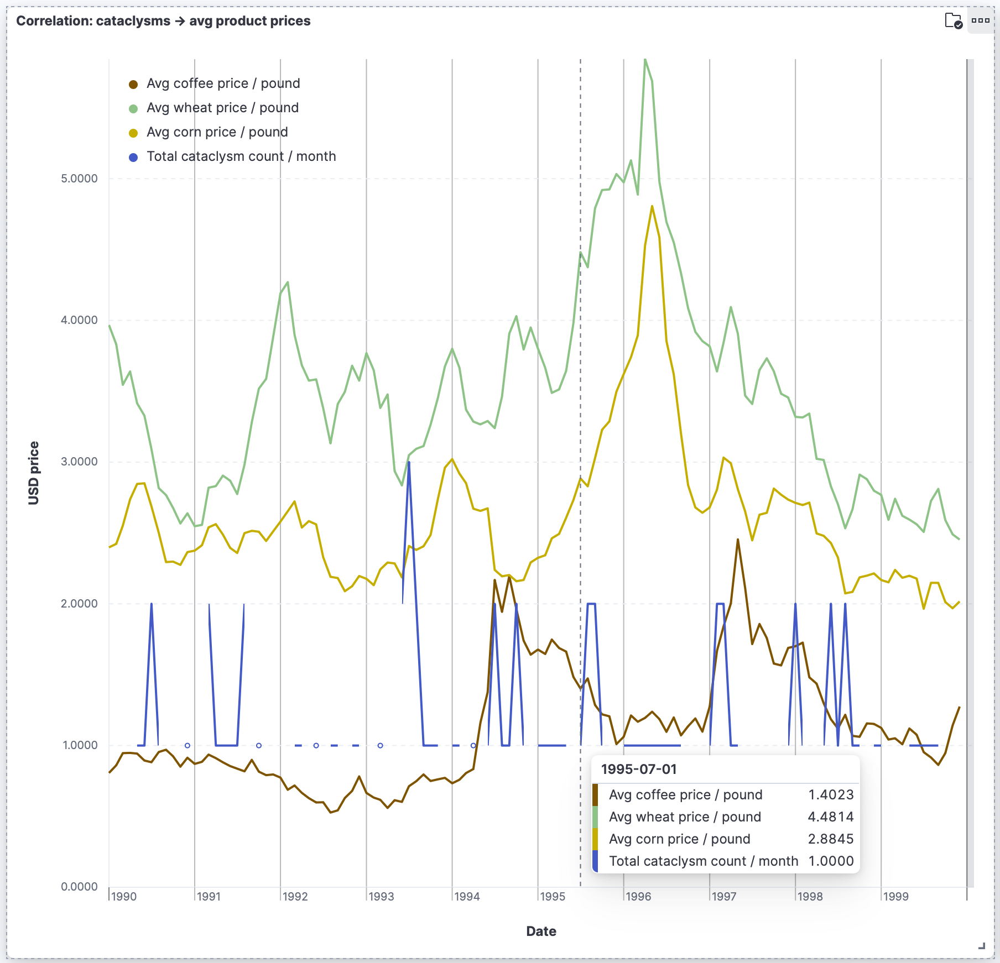
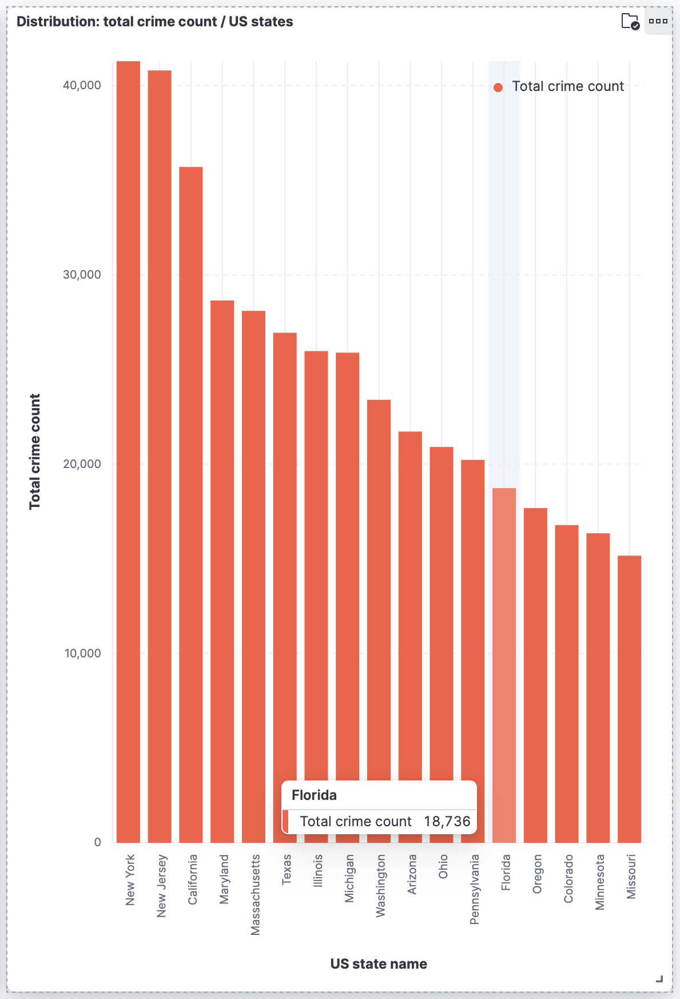
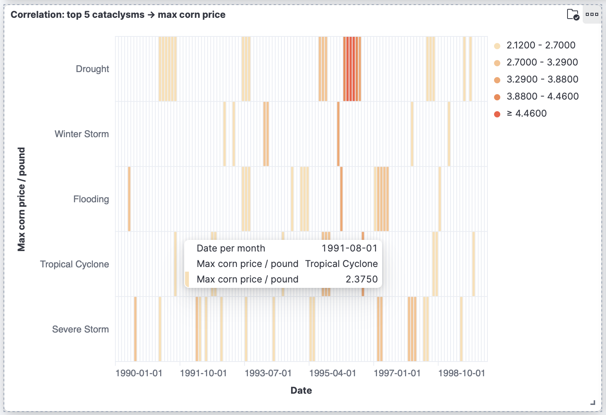
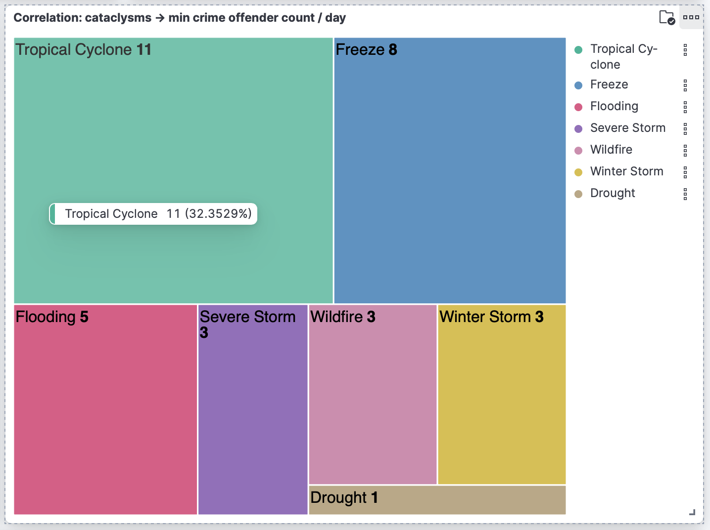
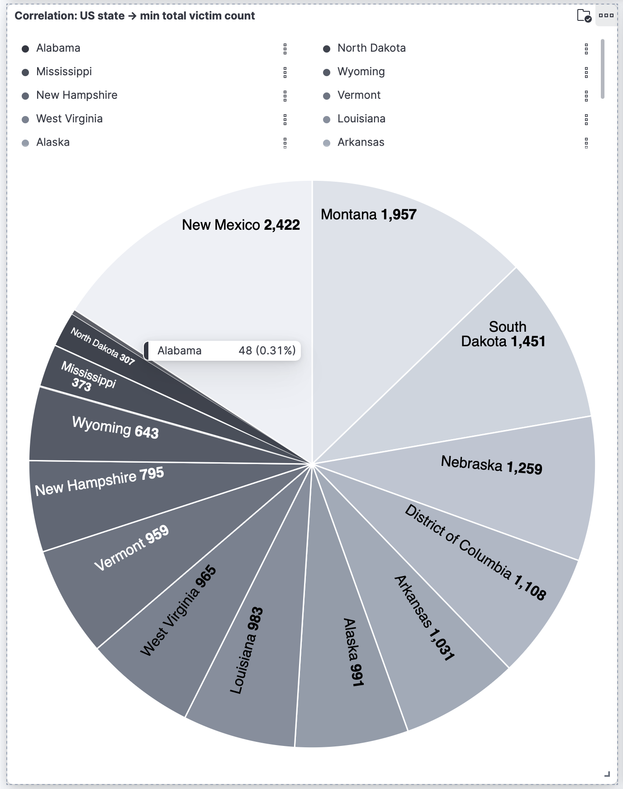
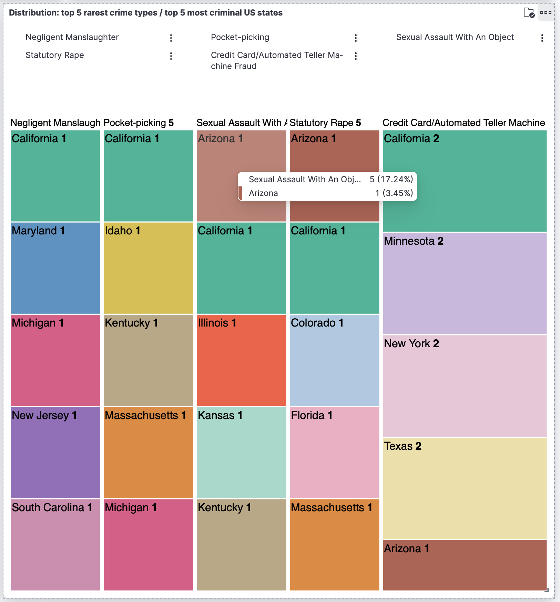
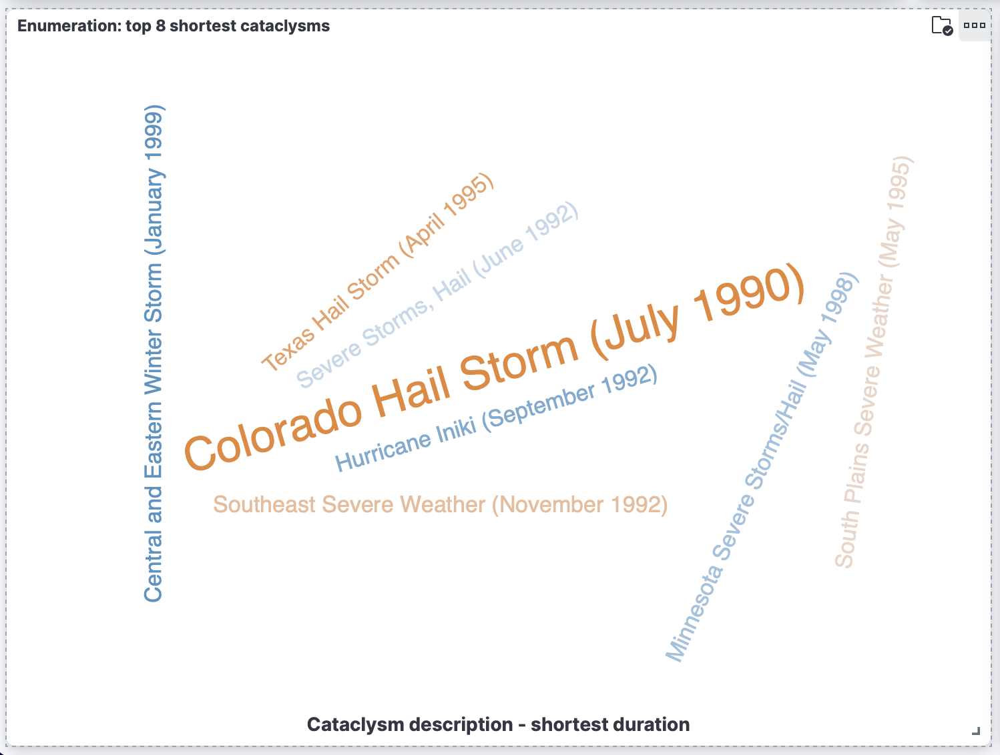
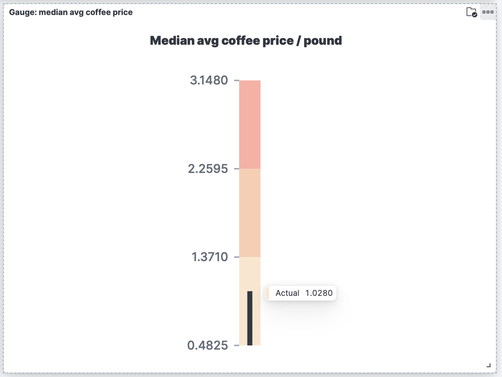

# 📈 **Analysis of Graphs for Socio-Economic and Climatic Data (1990-2000)** 📈

## Graph 1: Correlation Between Cataclysms and Average Product Prices

This line graph provides a visual representation of the correlation between the average prices of essential commodities such as coffee, wheat, and corn (measured in USD per pound) against the total monthly count of cataclysmic events over a period from 1990 to 2000.

**Creation** 🛠️: I set up a line chart with the dates on the horizontal axis to track changes over time, and the USD price on the vertical axis. I then added each data series, choosing distinct colors for clarity. I made sure to aggregate the data by month to smooth out any short-term fluctuations and highlight longer-term trends. 

Key observations from the graph include:
- **Average Coffee Price Fluctuations** ☕️: The price of coffee per pound shows volatility over the observed period, with notable peaks that do not seem to directly correlate with cataclysmic events. This might suggest that coffee prices are influenced by other market factors beyond the scope of natural disasters.

- **Wheat Price Peaks** 🌾: The wheat price per pound demonstrates a clear peak around 1995, which aligns with a noticeable spike in the total count of cataclysms. This indicates a potential direct impact of climatic events on wheat prices, likely due to supply disruptions caused by such disasters.

- **Corn Price Trends** 🌽: Corn prices also exhibit fluctuations, though less pronounced than wheat, and do not display a consistent correlation with the cataclysm count. This could imply a more complex set of factors affecting corn prices, where climatic events are only one of many influences.

---

## Graph 2: Distribution of Total Crime Count Across US States

This bar chart displays the total crime count distributed across various US states for the period 1990-2000. The data highlight significant variations in crime rates between states, with some states showing markedly higher counts than others.

**Creation** 🛠️: I placed the state names on the horizontal axis and the crime counts on the vertical axis to compare the data at a glance. Using a vertical bar graph allowed for an intuitive understanding of the differences between states. I chose a color that would stand out and sorted the bars in descending order to highlight the states with the highest crime rates prominently.

Key observations:
- **Variations Across States** 🇺🇸: There is a noticeable decrease in crime counts from states like New York and New Jersey to states like Colorado and Missouri, suggesting possible correlations with state population sizes, urbanization rates, or law enforcement policies.

---

## Graph 3: Correlation Between Top 5 Cataclysms and Maximum Corn Price

The presented heatmap focuses on the relationship between five major types of cataclysms and the maximum corn prices during the 1990s. Each horizontal band represents a different cataclysm type, with the color gradient indicating the corn price level during these events.

**Creation** 🛠️: I plotted the maximum corn price per pound against the time on the horizontal axis and categorized by the type of climatic event on the vertical axis. The color intensity represents the price range, with darker shades indicating higher prices. This visualization technique is particularly effective for spotting patterns or anomalies over time and across different categories of climatic events, allowing for a quick assessment of how weather conditions might correlate with fluctuations in commodity prices.

Here are the observations:
- **Predominance of Droughts** ☀️: The graph clearly shows that drought periods correspond to the highest peaks in corn prices, suggesting that droughts have a substantial impact on the supply and, consequently, the cost of corn.
- **Lesser Impact of Other Events** ❄️: While tropical cyclones, winter storms, flooding, and severe storms are also represented, their color intensity is less pronounced than that for droughts, indicating a lower correlation with the highest corn prices.

---

## Graph 4: Correlation Between Cataclysms and Minimum Crime Offender Count per Day

The treemap provides a visualization of the minimum crime offender count per day in relation to various types of cataclysms. Each colored section represents a different type of cataclysm and its proportional contribution to the minimum crime offender count recorded.

**Creation** 🛠️: I grouped the data by the type of cataclysm and used the metric of minimum crime offenders to size each block. The blocks are color-coded and proportionally sized according to the frequency of each cataclysm type, with larger blocks indicating a higher occurrence. This visualization helps to quickly identify which types of cataclysms are most prevalent and their relative impact on crime, highlighting the most significant climatic events that correlate with the lowest number of crime offenders.

Observations from the graph:
- **Dominance of Tropical Cyclones** 🌪️: Tropical cyclones appear most frequently in the dataset, suggesting a potential correlation with days of lower crime rates.

- **Variety of Cataclysmic Events** ☁️: Other events such as freezes, floods, and severe storms also seem to contribute to days with lower crime offender counts.

- **Rare Incidences** ☀️: Some cataclysm types, like droughts, show minimal correlation with the crime offender count, possibly due to their less immediate impact on daily activities compared to more disruptive events.

---

## Graph 5: US State vs Minimum Total Victim Count

The pie chart provides a visual comparison of the minimum total victim count across various US states. Each slice of the pie represents a state, with the size of the slice correlating to the number of victims reported.

**Creation** 🛠️: I selected the top 15 states with the minimal victim counts as the slice criteria and set the total number of victims as the metric for the chart. Each slice of the pie represents a state, with the size indicating the number of victims; this visual format effectively communicates the comparative scale of victim counts in a clear, easily digestible manner.

Key Observations:
- **Lower Victim Counts** 📉: States like Alabama and Mississippi show remarkably low minimum victim counts, potentially indicating effective crime prevention strategies or lower reporting rates in these regions.

- **Higher Counts in New Mexico** 📈: New Mexico, on the other hand, stands out with a significantly higher minimum number of victims, suggesting varying levels of criminal activity or differences in population density that could affect these numbers.

---

## Graph 6: Distribution of Top 5 Rarest Crime Types vs Top 5 Most Criminal US States

The treemap visualizes a distribution of the five rarest types of crimes across the five US states with the highest crime rates. Each colored section of the treemap corresponds to a different state and crime type, with the size of the section representing the count of that particular crime in the state.

**Creation** 🛠️: I have illustrated the intersection of the top 5 least frequent crime types with the top 5 states where these crimes were reported. The dimensions of each colored segment correspond to the count of records for each crime type within the respective state. This type of visualization helps in identifying patterns and outliers in the data, showcasing how certain crimes are distributed across different states. Each block's size and color shading represent the frequency of the crime, providing a quick visual assessment of the data's distribution.

Key Observations:
- **Diverse Crime Types** 🔫: The graph displays a variety of rare crime types, such as negligent manslaughter and pocket-picking, scattered across different states. This indicates a wide range of criminal activities that occur less frequently.

---

## Graph 7: Enumeration of Top 8 Shortest Cataclysms

This graph enumerates the top eight cataclysms with the shortest durations. The size of the text correlates with the brevity of the event, with the "Colorado Hail Storm (July 1990)" prominently highlighted as the shortest.

**Creation** 🛠️: I've depicted the top 8 shortest-duration cataclysmic events. The size of each tag correlates with the brevity of the event it represents — the larger the font, the shorter the event. This visual technique effectively highlights the most significant events in terms of their unexpectedly short duration, like the prominent "Colorado Hail Storm (July 1990)", making it immediately apparent which events were the most fleeting.

Observations:
- **Colorado Hail Storm** 🌪️: The central focus is on the Colorado Hail Storm, which evidently stands out due to its particularly short duration.

- **Variety of Events** ⚡️: The graph features a range of weather-related events from hail storms to hurricanes, indicating the diverse nature of quick yet impactful cataclysms.

- **Geographical Spread** 🌏: The listed events cover various geographical regions, from Texas to Minnesota, suggesting that short-duration cataclysms are widespread and not confined to one particular area.

---

## Graph 8: Gauge of Median Average Coffee Price

The gauge chart illustrates the median average price of coffee per pound. The shaded area represents a range of prices, with the median marked by a dividing line, and the pointer indicates the actual observed price.

**Creation** 🛠️: I'm showcasing the median average price of coffee per pound. The gauge's needle points to the actual value, indicating its position relative to the minimum and maximum values set in the data range. This visual format allows for an immediate grasp of how the actual price compares to the typical price range, emphasizing whether the current price is low, moderate, or high within the context of the historical data.

Key Points:
- **Actual Price Observation** 💵: The median average coffee price shown by the pointer is at 1.0280 USD per pound, which falls below the median, suggesting that the observed value is on the lower end of the price spectrum.

- **Price Range Visualization** 📊: The gauge displays a price range from the lowest to the highest observed, with the median dividing this range into two halves, thereby offering a quick visual reference for where the actual price falls relative to other data points.
